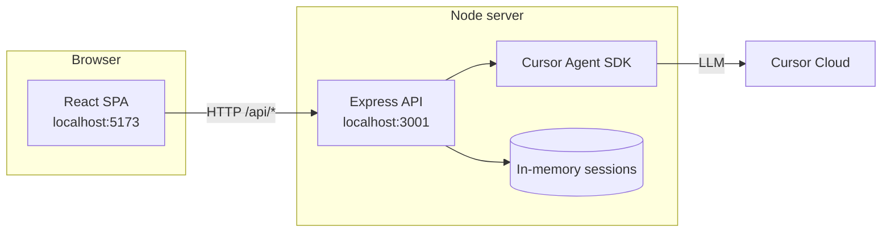
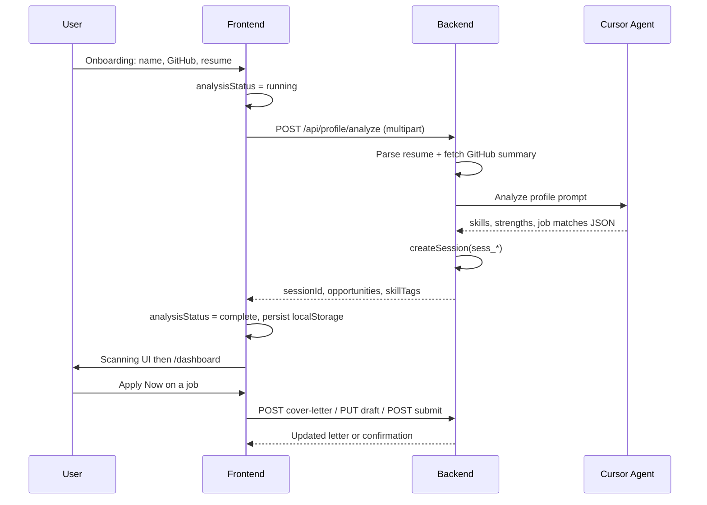
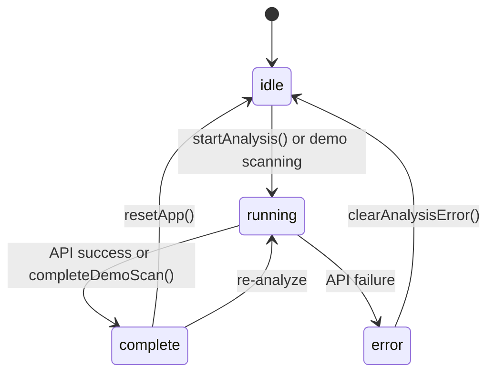

# System overview — OpportunityAgent

This document explains **how the application is put together**: components, data flow, API modes, and where state lives. For setup commands, see [README.md](./README.md). For endpoint details, see [BACKEND.md](./BACKEND.md).

---

## 1. High-level architecture

The project is a **monorepo** with two runnable apps:



| Layer | Folder | Role |
|-------|--------|------|
| **Presentation** | `frontend/` | Pages, layout, forms, mock fallback |
| **API** | `backend/` | REST routes, file upload, session storage |
| **AI** | `backend/src/services/cursorAgent.ts` | Prompts + JSON parsing for agent output |
| **Contracts** | `BACKEND.md` | Shared API shape between UI and server |

In development, Vite **proxies** `/api` → `http://localhost:3001`, so the browser always calls same-origin `/api/...`.

---

## 2. User journey (happy path)



---

## 3. Frontend structure

```
frontend/src/
├── pages/              # One file per route
│   OnboardingPage      # /
│   ScanningPage        # /scanning
│   DashboardPage       # /dashboard
│   LeadsPage, NetworkPage, ProfilePage
├── components/
│   layout/             # Header, Sidebar, BottomNav, AppShell
│   routes/             # RequireAnalysis guard
│   opportunities/      # OpportunityCard
│   onboarding/         # Mobile sticky Analyze bar
│   ui/                 # Icon, ErrorBanner, ApiStatusBanner
├── features/
│   ApplicationHelperPanel   # Slide-over apply flow
├── context/            # AppProvider: global state + persistence
├── api/                # HTTP client, mock handlers, health check
├── data/               # Seed opportunities (mock + fallback only)
└── lib/storage.ts      # localStorage wrapper
```

### Routing & guards

| Route | Guard | If blocked |
|-------|-------|------------|
| `/` | None | Always onboarding |
| `/scanning` | `running-only` | Idle → `/`; complete → `/dashboard` |
| `/dashboard`, `/leads`, … | `complete-only` | Not complete → `/` |

### Global state (`AppContext`)

| Field | Purpose |
|-------|---------|
| `profile` | Name, GitHub, LinkedIn, resume flags |
| `analysisStatus` | `idle` \| `running` \| `complete` \| `error` |
| `opportunities` | Job cards from API or demo |
| `skillTags`, `aiStrengths`, `rolesScanned` | Dashboard hero |
| `selectedOpportunity` | Opens Application Helper panel |
| `sessionId` | Backend session after live analyze |
| `backendConnected` | Health check when live mode |

**Persistence:** `localStorage` key `opportunity-agent:app-state` saves profile + analysis + opportunities so refresh keeps the session.

### API modes (frontend)

Controlled by `VITE_USE_MOCK_API`:

| Mode | `VITE_USE_MOCK_API` | Behavior |
|------|---------------------|----------|
| **Mock** | `true` (or unset in old `.env`) | `frontend/src/api/mock/handlers.ts` — fixed seed jobs, ~3s delay |
| **Live** | `false` | `fetch` to `/api/*` → Express → Cursor agent |

UI indicators:

- **ApiStatusBanner** on onboarding (green / amber / red)
- **Header badge** — Mock / Live API / Offline

### Demo shortcuts vs real flow

| User action | Data source |
|-------------|-------------|
| **Analyze Profile** | Backend + agent (or mock if enabled) |
| **Jump to any screen (demo)** | `loadDemoForScreen()` — frontend seed only |
| Regenerate cover letter / save / submit | Backend (or mock) |

---

## 4. Backend structure

```
backend/src/
├── index.ts                 # Express app, CORS, /api/health
├── routes/
│   profile.ts               # POST /analyze (multer + agent)
│   opportunities.ts         # GET list, POST cover-letter
│   applications.ts          # PUT draft, POST submit
├── services/
│   cursorAgent.ts           # Cursor SDK prompts & JSON extraction
│   github.ts                # Public GitHub profile summary
│   resumeParser.ts          # PDF/text extraction for uploads
├── store/session.ts         # In-memory session per sess_*
└── middleware/session.ts    # Attach session from header/body
```

### Analyze pipeline (`POST /api/profile/analyze`)

1. Validate **name** and resume/GitHub rules.
2. **Resume:** Multer memory buffer → `resumeParser` (PDF/text).
3. **GitHub:** Optional `fetchGitHubProfileSummary` for public repos.
4. **Agent:** Single structured prompt → JSON with `skillTags`, `aiStrengths`, `rolesScanned`, `opportunities[]`.
5. **Session:** `createSession({ sessionId, profile, opportunities, … })`.
6. Response matches `AnalyzeProfileResponse` in `BACKEND.md`.

If `CURSOR_API_KEY` is missing and `USE_AGENT_FALLBACK=true`, server returns deterministic seed data instead of calling the agent.

### Session model

- Sessions are **in-memory** (lost on server restart).
- Frontend stores `sessionId` and sends it on subsequent calls (see `BACKEND.md` / middleware).
- Opportunities for a session are served from the store after analyze.

---

## 5. Key integrations

| Integration | Where | Notes |
|-------------|-------|-------|
| **Cursor Agent SDK** | `cursorAgent.ts` | Model `composer-2`; parses JSON from agent text |
| **GitHub API** | `github.ts` | Public profile/repos for analyze context |
| **Resume upload** | `profile.ts` + `resumeParser.ts` | PDF/DOC/DOCX, max 10 MB |
| **Vite proxy** | `frontend/vite.config.ts` | `/api` → `localhost:3001` |

---

## 6. Analysis state machine (frontend)



---

## 7. Security & secrets

| Item | Practice |
|------|----------|
| `CURSOR_API_KEY` | Only in `backend/.env` (gitignored) |
| `frontend/.env` | No secrets; only `VITE_*` public vars |
| CORS | Allows `localhost:5173` and preview port |

Never commit `.env` files. Judges must supply their own API key.

---

## 8. What to read next

| Goal | Document |
|------|----------|
| Run the demo | [SUBMISSION.md](./SUBMISSION.md) |
| Implement or test APIs | [BACKEND.md](./BACKEND.md) |
| Install & scripts | [README.md](./README.md) |
