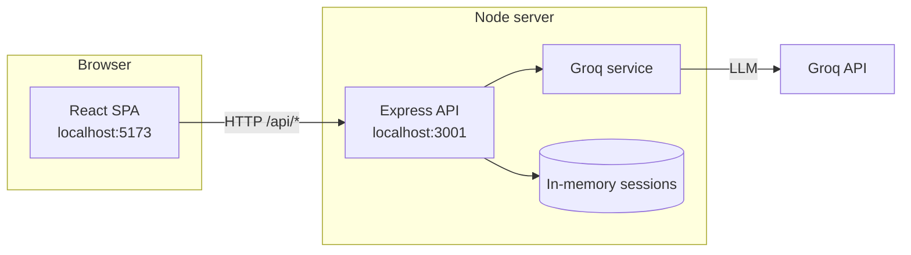
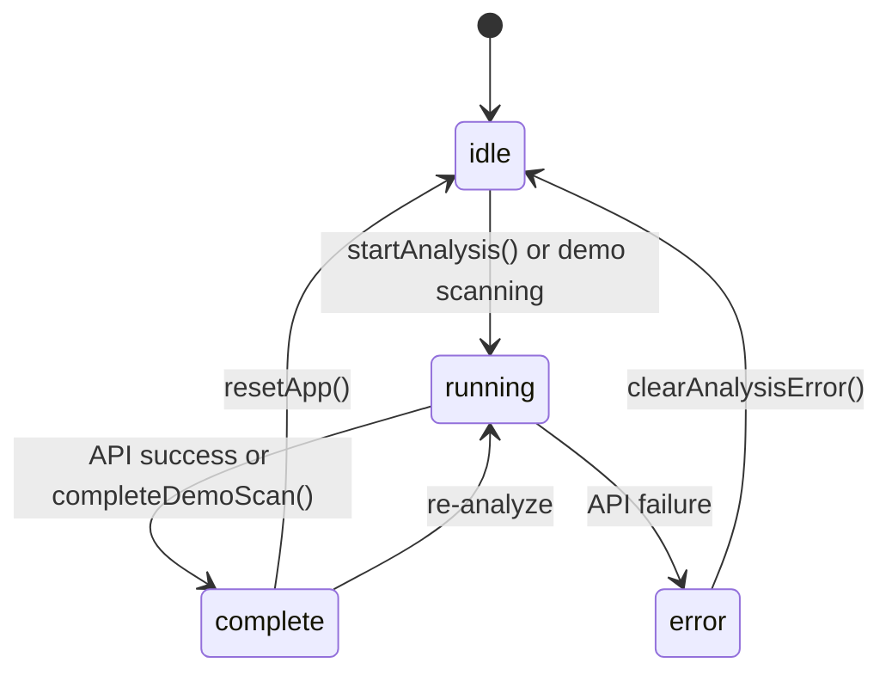
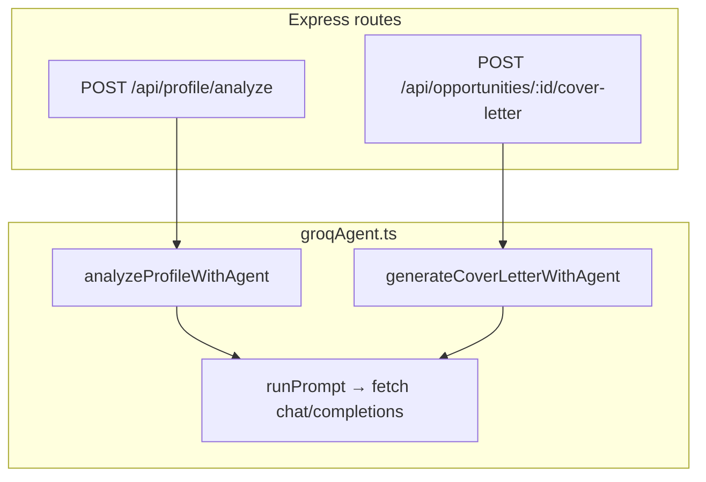

# System overview — OpportunityAgent

This document explains **how the application is put together**: components, data flow, API modes, and where state lives. For setup commands, see [README.md](./README.md). For endpoint details, see [BACKEND.md](./BACKEND.md).

---

## 1. High-level architecture

The project is a **monorepo** with two runnable apps:



| Layer | Folder | Role |
|-------|--------|------|
| **Presentation** | `frontend/` | Pages, layout, forms, mock fallback |
| **API** | `backend/` | REST routes, file upload, session storage |
| **AI** | `backend/src/services/groqAgent.ts` | Prompts + JSON parsing for agent output |
| **Contracts** | `BACKEND.md` | Shared API shape between UI and server |

In development, Vite **proxies** `/api` → `http://localhost:3001`, so the browser always calls same-origin `/api/...`.

---

## 2. User journey (happy path)


---

## 3. Frontend structure

```
frontend/src/
├── pages/              # One file per route
│   OnboardingPage      # /
│   ScanningPage        # /scanning
│   DashboardPage       # /dashboard
│   LeadsPage, NetworkPage, ProfilePage
├── components/
│   layout/             # Header, Sidebar, BottomNav, AppShell
│   routes/             # RequireAnalysis guard
│   opportunities/      # OpportunityCard
│   onboarding/         # Mobile sticky Analyze bar
│   ui/                 # Icon, ErrorBanner, ApiStatusBanner
├── features/
│   ApplicationHelperPanel   # Slide-over apply flow
├── context/            # AppProvider: global state + persistence
├── api/                # HTTP client, mock handlers, health check
├── data/               # Seed opportunities (mock + fallback only)
└── lib/storage.ts      # localStorage wrapper
```

### Routing & guards

| Route | Guard | If blocked |
|-------|-------|------------|
| `/` | None | Always onboarding |
| `/scanning` | `running-only` | Idle → `/`; complete → `/dashboard` |
| `/dashboard`, `/leads`, … | `complete-only` | Not complete → `/` |

### Global state (`AppContext`)

| Field | Purpose |
|-------|---------|
| `profile` | Name, GitHub, LinkedIn, resume flags |
| `analysisStatus` | `idle` \| `running` \| `complete` \| `error` |
| `opportunities` | Job cards from API or demo |
| `skillTags`, `aiStrengths`, `rolesScanned` | Dashboard hero |
| `selectedOpportunity` | Opens Application Helper panel |
| `sessionId` | Backend session after live analyze |
| `backendConnected` | Health check when live mode |

**Persistence:** `localStorage` key `opportunity-agent:app-state` saves profile + analysis + opportunities so refresh keeps the session.

### API modes (frontend)

Controlled by `VITE_USE_MOCK_API`:

| Mode | `VITE_USE_MOCK_API` | Behavior |
|------|---------------------|----------|
| **Mock** | `true` (or unset in old `.env`) | `frontend/src/api/mock/handlers.ts` — fixed seed jobs, ~3s delay |
| **Live** | `false` | `fetch` to `/api/*` → Express → Groq API |

UI indicators:

- **ApiStatusBanner** on onboarding (green / amber / red)
- **Header badge** — Mock / Live API / Offline

### Demo shortcuts vs real flow

| User action | Data source |
|-------------|-------------|
| **Analyze Profile** | Backend + agent (or mock if enabled) |
| **Jump to any screen (demo)** | `loadDemoForScreen()` — frontend seed only |
| Regenerate cover letter / save / submit | Backend (or mock) |

---

## 4. Backend structure

```
backend/src/
├── index.ts                 # Express app, CORS, /api/health
├── routes/
│   profile.ts               # POST /analyze (multer + agent)
│   opportunities.ts         # GET list, POST cover-letter
│   applications.ts          # PUT draft, POST submit
├── services/
│   groqAgent.ts             # Groq REST prompts & JSON extraction
│   github.ts                # Public GitHub profile summary
│   resumeParser.ts          # PDF/text extraction for uploads
├── store/session.ts         # In-memory session per sess_*
└── middleware/session.ts    # Attach session from header/body
```

### Analyze pipeline (`POST /api/profile/analyze`)

1. Validate **name** and resume/GitHub rules.
2. **Resume:** Multer memory buffer → `resumeParser` (PDF/text).
3. **GitHub:** Optional `fetchGitHubProfileSummary` for public repos.
4. **Agent:** Single structured prompt → JSON with `skillTags`, `aiStrengths`, `rolesScanned`, `opportunities[]`.
5. **Session:** `createSession({ sessionId, profile, opportunities, … })`.
6. Response matches `AnalyzeProfileResponse` in `BACKEND.md`.

If `GROQ_API_KEY` is missing and `USE_AGENT_FALLBACK=true`, server returns deterministic seed data instead of calling the agent.

### Session model

- Sessions are **in-memory** (lost on server restart).
- Frontend stores `sessionId` and sends it on subsequent calls (see `BACKEND.md` / middleware).
- Opportunities for a session are served from the store after analyze.

---

## 5. Key integrations

| Integration | Where | Notes |
|-------------|-------|-------|
| **Groq API** | `groqAgent.ts` | See [§8 Implementing the Groq API](#8-implementing-the-groq-api) |
| **GitHub API** | `github.ts` | Public profile/repos for analyze context |
| **Resume upload** | `profile.ts` + `resumeParser.ts` | PDF/DOC/DOCX, max 10 MB |
| **Vite proxy** | `frontend/vite.config.ts` | `/api` → `localhost:3001` |

---

## 6. Analysis state machine (frontend)



---

## 7. Security & secrets

| Item | Practice |
|------|----------|
| `GROQ_API_KEY` | Only in `backend/.env` (gitignored); sent only as the `Authorization: Bearer` header server-side |
| `frontend/.env` | No secrets; only `VITE_*` public vars |
| CORS | Allows `localhost:5173` and preview port |

Never commit `.env` files. Judges must supply their own API key.

---

## 8. Implementing the Groq API

This project calls the **Groq API** (OpenAI-compatible chat completions) directly with the built-in `fetch` — **no SDK dependency** — on the **backend only**. The React app never sees `GROQ_API_KEY`; it only calls your Express REST API.

### 8.1 Configure

**Environment** (`backend/.env`):

```env
GROQ_API_KEY=your_key_from_groq_console
GROQ_MODEL=llama-3.3-70b-versatile   # optional; falls back automatically if unavailable
USE_AGENT_FALLBACK=false             # true = skip the API, return seed jobs
PORT=3001
```

Get a free key from the [Groq Console](https://console.groq.com/keys). The health endpoint reports whether a usable key is present (placeholder values count as absent):

```bash
curl http://localhost:3001/api/health
# { "ok": true, "agent": true, "fallback": false }
```

### 8.2 Core pattern: `runPrompt`

All AI work goes through one helper in `backend/src/services/groqAgent.ts`. It POSTs to the chat-completions endpoint and reads back the assistant message:

```typescript
const res = await fetch('https://api.groq.com/openai/v1/chat/completions', {
  method: 'POST',
  signal: controller.signal,                 // AbortController → 60s timeout
  headers: { 'Content-Type': 'application/json', Authorization: `Bearer ${key}` },
  body: JSON.stringify({
    model,
    messages: [{ role: 'user', content: prompt }],
    temperature: 0.7,
    max_tokens: 4096,
    ...(json ? { response_format: { type: 'json_object' } } : {}),
  }),
});
const data = await res.json();
const text = data.choices?.[0]?.message?.content ?? '';
```

| Detail | Purpose in this app |
|--------|---------------------|
| `Authorization: Bearer` header | Authenticates server-side; key never appears in a URL/log |
| `response_format: json_object` | Forces clean JSON for the analyze call → reliable parsing (requires "json" in the prompt) |
| `AbortController` (60s) | Bounds the request so a stuck call can't hang the HTTP response |
| Model fallback chain | `GROQ_MODEL` → `openai/gpt-oss-120b` → `llama-3.1-8b-instant`; a `404`/decommissioned **or a `429` rate limit** falls through to the next (Groq limits are per-model) |

Profile analyze is typically **2–15 seconds**; the frontend scanning UI covers that wait.

### 8.3 Where the API is called



| Function | Triggered by | Output |
|----------|--------------|--------|
| `analyzeProfileWithAgent` | `POST /api/profile/analyze` | `skillTags`, `aiStrengths`, `rolesScanned`, `opportunities[]` |
| `generateCoverLetterWithAgent` | `POST /api/opportunities/:id/cover-letter` | Plain-text cover letter |

**Pre-agent steps:** resume parsing (`resumeParser.ts`), GitHub summary (`github.ts`). Their text is injected into the analyze prompt as context. The route fetches the GitHub summary once and passes it through so the service does not re-fetch it.

### 8.4 Prompt design

**Profile analysis** — one large prompt asks for **only JSON** with a fixed schema (skills, strengths, 4–6 jobs, cover letters, roadmaps), sent with `response_format: { type: 'json_object' }`. Candidate context is built in `buildEnrichedContext()`:

- Name, GitHub URL, LinkedIn  
- GitHub repo summary (REST)  
- Resume text (PDF/DOC extract)

**Cover letter** — separate prompt with candidate excerpt + job title/company/rationale; response is **plain text** (no `response_format`).

Tips that work well here:

1. **Be explicit about output shape** — include a JSON example in the prompt.  
2. **Use `response_format: { type: 'json_object' }`** for structured responses (keep the word "json" in the prompt).  
3. **Keep instructions task-focused**, not chatty.  
4. **Cap size** — resume excerpt truncated (~8–12k chars); cover letter prompt uses ~2500 chars of resume.

### 8.5 Parsing responses

`runPrompt` returns the joined candidate text; the analyze path then:

1. **`extractJsonPayload<T>()`** — strips markdown fences, finds `{ ... }` or `[ ... ]`, `JSON.parse` (defensive even though JSON mode is requested).  
2. **`normalizeOpportunity()`** — validates fields, generates `id` slugs, clamps `matchScore`, default roadmap steps.  
3. On parse failure or empty opportunities → **fallback** (see below).

For cover letters, the raw string is used if length > 80 characters; otherwise the existing letter on the opportunity is kept.

### 8.6 Fallback when the API fails

| Condition | Behavior |
|-----------|----------|
| No usable `GROQ_API_KEY` and `USE_AGENT_FALLBACK` not forced | `analyze` throws → route returns `503 AGENT_NOT_CONFIGURED` |
| `USE_AGENT_FALLBACK=true` | `seedFallback()` — static jobs from `backend/src/data/opportunities.ts` |
| API error or invalid JSON | `analyzeProfileWithAgent` catches, logs `[groq-agent]`, returns `seedFallback()` (when fallback enabled) or rethrows |

For hackathon demos, prefer a valid API key and `USE_AGENT_FALLBACK=false` so judges see real output.

### 8.7 End-to-end: add a new AI feature

Example: “explain why this job matches” endpoint.

1. **Route** — `backend/src/routes/opportunities.ts` → `POST /api/opportunities/:id/explain`
2. **Service** — `explainMatchWithAgent(profile, opportunity)` in `groqAgent.ts`:
   - Build a short prompt with profile + job fields.  
   - `const text = await runPrompt(prompt, { json: false });`  
   - Return `{ explanation: text }`.
3. **Frontend** — add `apiRequest` in `frontend/src/api/opportunityAgentApi.ts` and call from a button in `OpportunityCard.tsx`.
4. **Contract** — document request/response in `BACKEND.md`.

Do **not** call Groq from the frontend; keep all AI calls server-side.

### 8.8 Local vs production

| Environment | Server | Notes |
|-------------|--------|-------|
| `npm run dev:backend` | `backend/src/index.ts` listens on `:3001` | Standard local hackathon setup |
| Vercel Services | `backend/index.ts` exports Express `app` | No `listen()`; see [DEPLOYMENT.md](./DEPLOYMENT.md) |
| Mock frontend | API not called | `VITE_USE_MOCK_API=true` |

### 8.9 Debugging

| Symptom | Check |
|---------|--------|
| `GROQ_API_KEY is not set` | `backend/.env` loaded; key isn't the `.env.example` placeholder |
| Analyze always shows Lumina/Nebula seed jobs | Fallback path — inspect server logs for `[groq-agent]` warnings; check `/api/health` `"agent"` |
| `Model "…" is not available` | Your key lacks that model — set `GROQ_MODEL` to a current one (e.g. `llama-3.1-8b-instant`) |
| `Model "…" is rate limited` | Per-model limit hit; the chain falls through automatically, or set `GROQ_MODEL` to a less-used model |
| Request times out | Bounded at 60s; check network egress to `api.groq.com` |
| Invalid JSON | Log the raw `runPrompt` output; tighten prompt or improve `extractJsonPayload` |

Official docs: [Groq API reference](https://console.groq.com/docs).

---

## 9. What to read next

| Goal | Document |
|------|----------|
| Run the demo | [SUBMISSION.md](./SUBMISSION.md) |
| Implement or test APIs | [BACKEND.md](./BACKEND.md) |
| Install & scripts | [README.md](./README.md) |
| Deploy to Vercel | [DEPLOYMENT.md](./DEPLOYMENT.md) |
